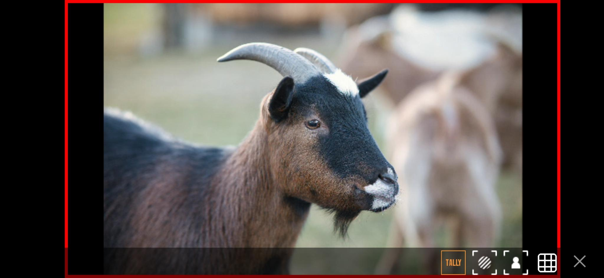

# FeedWatch

Android App to view [NDI®](http://ndi.tv/)- or UVC (**U**SB **V**ideo **C**lass Device) Feed on an Android mobile phone.

This project was renamed from NDIMonitor to FeedWatch to avoid confusion with the official 
NDI® Tools app "NDI® Video Monitor" and I don't want to get in trouble with Vizrt ;)

## Features

### Video Sources

- **NDI® High Bandwidth Monitoring**
    - Supports NDI® High Bandwidth sources
    - Since NDI® can be network-intensive, using a **USB-C Ethernet adapter** is strongly recommended.
    - **NDI® HX** is currently not supported. I invested some effort and implemented
  a working prototype. However, in order to receive NDI® HX streams for
  longer than 5 minutes, you need currently a NDI® Advanced SDK license.
  Even if I had a license - which I do not - publishing the source code
  would not be useful, because I would not be able to publish the license
  itself. Anyone who wanted to use this functionality would need to obtain
  the appropriate license independently.

- **UVC HDMI Capture Cards**  
  The app can capture video from **UVC-compatible devices**, such as USB HDMI capture cards.  
  This functionality was developed and tested with a low-cost **UGREEN Video Capture Card** (Amazon), which performed
  reliably.  
  Any supported UVC device will automatically appear as an available source.
 

### Low Bandwidth Mode

Low Bandwidth Mode reduces network and CPU usage by using the NDI proxy stream instead of the full-resolution video feed. This mode is ideal when your android device is only connected to a wireless network. 
While image quality is reduced compared to the full NDI stream it can nevertheless be enough to check feed existence, framing or exposure. 

You can enable Low Bandwidth Mode in the app’s Settings page (Three-Dot Menu -> Settings)

---

## Monitoring Tools

### NDI Tally

- Displays NDI® tally information (red for program /green for preview) for NDI sources

### Focus Peaking

- Simple focus peaking implementation
- Fixed sharpness sensitivity: **70%**

---

### Zebra

- Exposure warning using zebra stripes
- Fixed threshold: **95 IRE**

---

### Grid Overlay

- **3×3 composition grid** for framing assistance

## Build Requirements

Before building, we need to make sure that the following components are installed:

- Java Development Kit (JDK) 11
- Android SDK Platform 33
- NDI SDK for Android

### 1. Java 11

This project must be built with Java 11. Newer Java versions (e.g. Java 17) may cause Gradle or NDK build failures.
The reason is, that this project should be runnable on older phones. Android SDK Platform Level 33 uses Java 11.

### 2. Android SDK

Install Android SDK Platform 33. Instruction can be
found [here](https://developer.android.com/about/versions/13/setup-sdk)

### 3. Download and Install the NDI SDK

Download the NDI SDK for Android from the [official site](https://ndi.video/for-developers/ndi-sdk/download/)

Follow the installer instructions for your platform and note the installation directory.

### 3.1 Copy NDI Header Files

After installation, copy the NDI header files into the project’s C++ include directory:

`cp <NDI_SDK_INSTALL_DIR>/NDI\ SDK\ for\ Android/include/* \ <PROJECT_ROOT>/FeedWatch/app/src/main/cpp/include/`

### 3.2 Copy NDI Library Binaries

Next, copy the NDI library binaries into the project’s jniLibs directory:

`cp <NDI_SDK_INSTALL_DIR>/NDI\ SDK\ for\ Android/lib/* <PROJECT_ROOT>/FeedWatch/app/src/main/jniLibs/`

Ensure that the copied libraries match the ABIs you intend to build for (e.g. arm64-v8a, armeabi-v7a).

### 4. Build the Project

`./gradlew assemble`

## State of this project

This app is in a very early development phase. Therefore it is not fully tested. It is possible that the app does not
work stable and that there are some ui or- performance glitches.

## License

NDI® is a registered trademark of the Vizrt Group. Also visit http://ndi.video for details.

This project is licensed under the APACHE License 2.0. See included [LICENSE](LICENSE) file.
